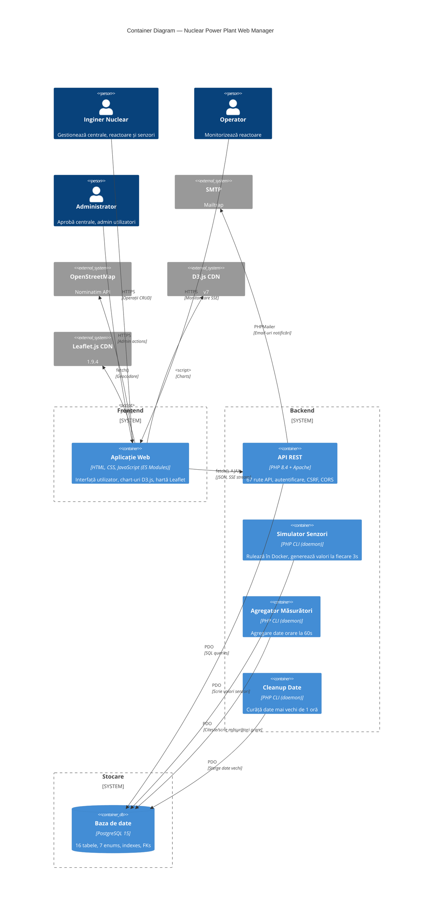

# Diagrama C4 — Container (Nivel 2)

## Containerele Sistemului

## Licență

Acest document și întregul proiect sunt licențiate sub [Creative Commons Attribution 4.0 International (CC BY 4.0)](https://creativecommons.org/licenses/by/4.0/).

## Descriere

### Containere

| Container | Tehnologie | Rol |
|---|---|---|
| **Aplicație Web** | HTML5, CSS3, JavaScript (ES Modules) | Interfața utilizator; încărcată în browser, comunică cu API-ul |
| **API REST** | PHP 8.4 + Apache (mod_php) | 67 rute, autentificare sesiuni, CSRF, CORS, validări |
| **Simulator Senzori** | PHP CLI (daemon) | Rulează în buclă infinită la 3s, generează valori realiste per tip reactor |
| **Agregator Măsurători** | PHP CLI (daemon) | Agregare date orare la 60s pentru statistici |
| **Cleanup Date** | PHP CLI (daemon) | Șterge date mai vechi de 1 oră (CLEANUP_INTERVAL) |
| **Baza de date** | PostgreSQL 15 | 16 tabele, 7 tipuri enum, indexes optimizați |

### Fluxuri de date principale

1. **CRUD**: Browser → API REST → PostgreSQL
2. **Monitorizare**: Simulator → PostgreSQL → API SSE → Browser (EventSource)
3. **Alerte**: Simulator → Observer Pattern → AlertRepository + EmailService
4. **Statistici**: Agregator → measurements_hourly → API Stats → Browser (D3.js)
5. **Autentificare**: Browser → API → Sesiune PHP → Verificare rol → Răspuns
