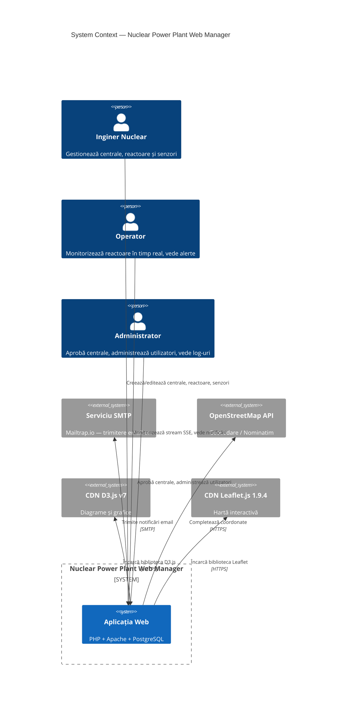

# Diagrama C4 — Context (Nivel 1)

## Sistem: Nuclear Power Plant Web Manager

## Licență

Acest document și întregul proiect sunt licențiate sub [Creative Commons Attribution 4.0 International (CC BY 4.0)](https://creativecommons.org/licenses/by/4.0/).

## Descriere

Diagrama de context C4 (Nivel 1) ilustrează sistemul și interacțiunile sale cu actorii externi:

- **Inginer Nuclear** — utilizator principal care creează și administrează centrale, reactoare și senzori
- **Operator** — monitorizează în timp real datele senzorilor și primește alerte
- **Administrator** — gestionează fluxul de aprobare al centralelor și utilizatorii
- **Servicii externe**: SMTP (Mailtrap), OpenStreetMap (geocodare), CDN-uri (D3.js, Leaflet.js)
