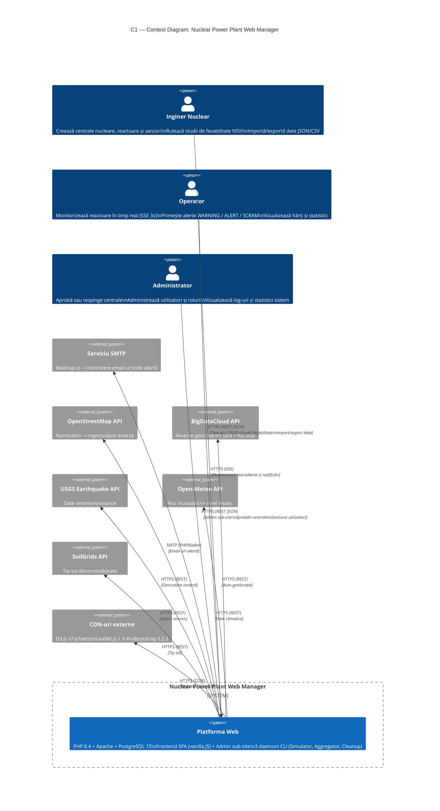

# Diagrama C1 — Context (Nivel 1)

## Sistem: Nuclear Power Plant Web Manager

## Actori

| Actor | Rol | Acțiuni principale |
|---|---|---|
| **Inginer Nuclear** | Utilizator principal | CRUD centrale, reactoare, senzori; studii fezabilitate; import/export |
| **Operator** | Monitorizare | Stream SSE timp real, alerte și notificări, hărți și statistici |
| **Administrator** | Staff | Aprobări centrale, gestionare utilizatori, vizualizare log-uri |

## Sisteme externe (7)

| Sistem | Protocol | Scop |
|---|---|---|
| SMTP (Mailtrap) | SMTP | Trimitere email-uri de alertă |
| OpenStreetMap/Nominatim | HTTPS REST | Geocodare inversă (lat/lon → adresă) |
| BigDataCloud | HTTPS REST | Reverse geocode + țară + fus orar |
| USGS Earthquake API | HTTPS REST | Date seismice istorice per coordonate |
| Open-Meteo API | HTTPS REST | Risc inundații și nivel freatic |
| SoilGrids API | HTTPS REST | Tip sol din coordonate |
| CDN-uri (D3.js, Leaflet, Bootstrap) | HTTPS | Biblioteci client-side |

## Licență

Acest document și întregul proiect sunt licențiate sub [Creative Commons Attribution 4.0 International (CC BY 4.0)](https://creativecommons.org/licenses/by/4.0/).
