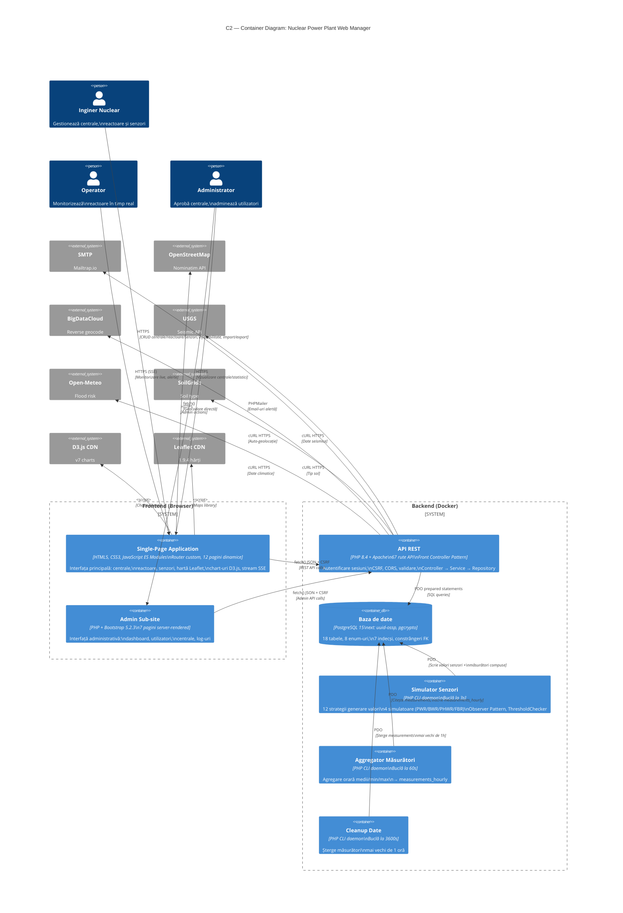

# Diagrama C2 — Container (Nivel 2)

## Containerele Sistemului



## Containere

| Container | Tehnologie | Funcție principală |
|---|---|---|
| **SPA** | HTML5, CSS3, JS ES Modules | Interfață utilizator, router custom, 12 pagini |
| **Admin Sub-site** | PHP + Bootstrap 5.2.3 | Interfață admin server-rendered, 7 pagini |
| **API REST** | PHP 8.4 + Apache | 67 rute REST, autentificare, CSRF, CORS |
| **PostgreSQL** | PostgreSQL 15 | Stocare date, 18 tabele, 8 enum-uri |
| **Simulator** | PHP CLI daemon | Generare valori senzori la 3s |
| **Aggregator** | PHP CLI daemon | Agregare orară la 60s |
| **Cleanup** | PHP CLI daemon | Curățare date vechi la 3600s |

## Fluxuri principale

```
Flux 1 — CRUD:         Browser → fetch() → API REST → PDO → PostgreSQL → JSON
Flux 2 — Monitorizare: Simulator (tick 3s) → INSERT measurements → API SSE → EventSource
Flux 3 — Alerte:       Simulator → ThresholdChecker → Observeri → DB + Email
Flux 4 — Statistici:   Aggregator (60s) → measurements_hourly → API Stats → D3.js
Flux 5 — Autentificare: Browser → API → Sesiune PHP → Middleware → Răspuns
Flux 6 — Geolocație:   Browser/API → BigDataCloud/USGS/Open-Meteo/SoilGrids → Auto-complete
```

## Licență

Acest document și întregul proiect sunt licențiate sub [Creative Commons Attribution 4.0 International (CC BY 4.0)](https://creativecommons.org/licenses/by/4.0/).
