# Diagrama C3 — Backend (Privire de ansamblu)

## Arhitectură stratificată

```mermaid
flowchart LR
  subgraph L0["Layer 0 - HTTP"]
    direction LR
    Apache["Apache\n.htaccess\nrewrite"]
    FC["index.php\nFront Controller"]
  end

  subgraph L1["Layer 1 - Router & Middleware"]
    direction LR
    Router["Router.php\n67 route definitions\nMethod dispatch"]
    MW["Middleware\nAuth / CSRF / CORS"]
  end

  subgraph L2["Layer 2 - Controller"]
    direction LR
    Ctrls["12 Controllere\n63 metode publice"]
  end

  subgraph L3["Layer 3 - Service"]
    direction LR
    Svcs["17 Servicii\nBusiness Logic"]
  end

  subgraph L4["Layer 4 - Repository"]
    direction LR
    Repos["14 Repository-uri\nData Access"]
  end

  subgraph L5["Layer 5 - Persistence"]
    direction LR
    PDO["PDO\nPrepared Statements"]
    DB["PostgreSQL 15\n18 tabele"]
  end

  Client["Browser SPA\n/ Admin Sub-site"] --> Apache
  Apache --> FC
  FC --> Router
  Router --> MW
  MW --> Ctrls
  Ctrls --> Svcs
  Svcs --> Repos
  Repos --> PDO
  PDO --> DB
```



## Fluxul unui request HTTP

```
Request HTTP
    │
    ▼
  Apache (.htaccess) → redirecționează la public/index.php
    │
    ▼
  Router.php → parsează ruta, extrage controller + metodă
    │
    ▼
  AuthMiddleware → verifică sesiune (dacă ruta e protejată)
    │
    ▼
  RoleMiddleware → verifică rol (requireRole ADMIN/ENGINEER/OPERATOR)
    │
    ▼
  CSRFMiddleware → verifică token CSRF (dacă e mutație)
    │
    ▼
  Controller → validează input, parsează JSON, extrage parametri
    │
    ▼
  Service → orchestră business logic, pattern-uri de design
    │
    ▼
  Repository → PDO prepared statement → PostgreSQL
    │
    ▼
  Controller → setează antete HTTP, răspunde cu JSON
    │
    ▼
  Client → parsează JSON, actualizează DOM
```

## Straturi — rezumat

| Layer | Conținut | Responsabilitate |
|---|---|---|
| **0 - HTTP** | Apache + `.htaccess` + `index.php` | Punct unic de intrare, rewrite |
| **1 - Router & Middleware** | `Router.php`, Auth, CSRF, CORS | Dirijare request, securitate |
| **2 - Controller** | 12 controllere | Procesare HTTP, validare input, răspuns JSON |
| **3 - Service** | 17 servicii | Business logic, pattern-uri de design |
| **4 - Repository** | 14 repo-uri | Acces date, PDO prepared statements |
| **5 - Persistence** | PDO + PostgreSQL 15 | Stocare și regăsire date |

## Licență

Acest document și întregul proiect sunt licențiate sub [Creative Commons Attribution 4.0 International (CC BY 4.0)](https://creativecommons.org/licenses/by/4.0/).
