# Diagrama C3 — Backend: Repository-uri și Rute

## Repository-uri (14)

```mermaid
flowchart TB
  subgraph Facade["Fațadă"]
    PlantRepoFacade["PlantRepositoryFacade\n← delegă la 4 repo-uri specializate"]
  end

  subgraph Plants["Domeniu: Centrale"]
    DetailsRepo["DetailsPlantRepository\nCRUD power_plants\nJOIN cu geological_data\nfindAll, findByUser, findById\nupdateStatus, save"]
    BasicRepo["BasicPlantRepository\nCRUD basic_data (1:1)\nfindByPlantId, save, update"]
    GeoRepo["GeologicalPlantRepository\nCRUD geological_data (1:1)\nfindByPlantId, save, update"]
    TechRepo["TechnicalPlantRepository\nCRUD technical_data +\nreactor_plant_data +\nreactor schema JOIN\nsave (tranzacție: INSERT\n+ auto-generare reactoare)"]
    FeasRepo["FeasibilityRepository\nINSERT + SELECT\nfeasibility_reports"]
  end

  subgraph Reactors["Domeniu: Reactoare"]
    ReactorRepo["ReactorRepository\nCRUD reactoare\nfindAllFromApprovedPlants"]
    SensorRepo["SensorRepository\nBulk INSERT din template\nupdate currentValue"]
    SensorTmplRepo["SensorTemplateRepository\nSELECT per reactor_type"]
    MeasRepo["MeasurementsRepository\nINSERT + SELECT +\naggregateHourly (UPSERT)"]
  end

  subgraph Alert["Domeniu: Alerte"]
    AlertRepo["AlertRepository\nINSERT alerts + reactor_alerts\nmarkAsRead, getUnread\ngetPlantOwnerEmail"]
  end

  subgraph System["Domeniu: Sistem"]
    UserRepo["UserRepository\nCRUD users\nfindByEmail, findByUsername\nupdateRole, delete"]
    ApprovalRepo["ApprovalRepository\nUpdate plant status"]
    LogRepo["LogRepository\nINSERT + SELECT\npurgeOlderThan 30 zile"]
  end

  PlantRepoFacade --> DetailsRepo
  PlantRepoFacade --> BasicRepo
  PlantRepoFacade --> GeoRepo
  PlantRepoFacade --> TechRepo

  DetailsRepo --> PP_DB["power_plants (table)"]
  BasicRepo --> BD_DB["basic_data (table)"]
  GeoRepo --> GD_DB["geological_data (table)"]
  TechRepo --> TD_DB["technical_data (table)"]
  TechRepo --> RPD_DB["reactor_plant_data (table)"]
  FeasRepo --> FR_DB["feasibility_reports (table)"]

  ReactorRepo --> R_DB["reactor (table)"]
  ReactorRepo --> CR_DB["control_rods (table)"]
  SensorRepo --> RS_DB["reactor_sensors (table)"]
  SensorRepo --> SR_DB["sensor_readings (table)"]
  SensorTmplRepo --> ST_DB["sensor_templates (table)"]
  MeasRepo --> M_DB["measurements (table)"]
  MeasRepo --> MH_DB["measurements_hourly (table)"]

  AlertRepo --> A_DB["alerts (table)"]
  AlertRepo --> RA_DB["reactor_alerts (table)"]

  UserRepo --> U_DB["users (table)"]
  ApprovalRepo --> PP_DB
  LogRepo --> L_DB["logs (table)"]
```

## Rute API (67)

```mermaid
flowchart LR
  subgraph Auth["Autentificare"]
    R1["GET/POST /register\nGET/POST /login\nGET /logout"]
  end

  subgraph Plants["Centrale"]
    R2["GET /api/power-plants\nGET /api/power-plants/{id}\nGET /api/power-plants/my\nGET /api/power-plants/map-data\nGET /api/power-plants/pending\nGET /api/power-plants/filter\nPOST /api/power-plants\nPATCH /{id}/status\nPATCH /{id}/submit-review\nPATCH /{id}/reopen\nPUT /{id}/details\nPOST /coordinates-preview"]
  end

  subgraph PlantData["Date Centrale"]
    R3["GET/POST/PUT /api/basic/{id}\nGET/POST/PUT /api/geological/{id}\nGET/POST/PUT /api/technical/{id}"]
  end

  subgraph Feas["Fezabilitate"]
    R4["GET /api/feasibility/{id}\nPOST /api/feasibility/{id}"]
  end

  subgraph Reactors["Reactoare"]
    R5["GET /api/reactors\nGET /api/reactors/{id}\nGET /api/plants/{id}/reactors\nPOST /api/reactors\nPUT /api/reactors/{id}\nDELETE /api/reactors/{id}"]
  end

  subgraph Sensors["Senzori"]
    R6["GET /api/reactors/{id}/stream (SSE)\nGET /api/reactors/{id}/sensors\nGET /api/sensors/{id}\nPOST /api/sensors\nPUT /api/sensors/{id}\nDELETE /api/sensors/{id}\nPOST /api/reactors/{id}/populate"]
  end

  subgraph Alerts["Alerte"]
    R7["POST /api/alerts/receive\nGET /api/alerts/unread\nPUT /api/alerts/{id}/read"]
  end

  subgraph Admin["Admin"]
    R8["PATCH /api/pending/{id}/admin-status\nGET /api/admin/users\nGET /api/admin/users/{id}\nPATCH /api/admin/users/{id}/role\nDELETE /api/admin/users/{id}"]
  end

  subgraph Misc["Altele"]
    R9["GET /api/stats\nGET /api/stats/measurements\nGET /api/notifications\nGET /api/rss/plants\nGET/POST import/export\nPOST /api/logs/frontend\nPOST /api/send-email"]
  end
```

## Licență

Acest document și întregul proiect sunt licențiate sub [Creative Commons Attribution 4.0 International (CC BY 4.0)](https://creativecommons.org/licenses/by/4.0/).
