# Diagrama C3 — Backend: Servicii

## Cele 17 servicii și dependențele lor

```mermaid
flowchart TB
  subgraph Plants["Domeniu: Centrale"]
    PlantFacade["PlantServiceFacade\n← delegă la 4 servicii specializate"]
    DetailsSvc["DetailsPlantService\nPlant CRUD, status, submit/review"]
    BasicSvc["BasicPlantService\nDate de bază (capacity, duration)"]
    GeoSvc["GeologicalPlantService\nAuto-geolocație (4 API-uri externe)"]
    TechSvc["TechnicalPlantService\nConfigurații tehnice, reactor schemas"]
    FeasSvc["FeasibilityService\nRulează CoR → NSVI score"]
  end

  subgraph Reactors["Domeniu: Reactoare și Senzori"]
    ReactorSvc["ReactorService\nCRUD reactoare, validare tip+răcire"]
    SensorSvc["SensorService\nCRUD senzori, populare template, stream"]
    SimSvc["SimulatorService\nBucler principal, factory, attach observeri"]
  end

  subgraph Alerts["Domeniu: Alerte și Notificări"]
    AlertSvc["AlertService\nProcesare alertă, debounce, email"]
    NotificationSvc["NotificationService\nAgregare alerte + evenimente centrală"]
  end

  subgraph System["Domeniu: Sistem"]
    UserSvc["UserService\nRegister/login bcrypt, role management"]
    ApprovalSvc["ApprovalService\nAprobare/respingere centrală"]
    StatsSvc["StatsService\nKPI-uri, grupări, chart data"]
    EmailSvc["EmailService\nPHPMailer SMTP, șabloane HTML"]
    LogSvc["LogService\nSingleton, 5 nivele, auto-cleanup 30 zile"]
    RSSSvc["RssService\nGenerare RSS 2.0 XML"]
  end

  PlantFacade --> DetailsSvc
  PlantFacade --> BasicSvc
  PlantFacade --> GeoSvc
  PlantFacade --> TechSvc

  FeasSvc --> PlantFacade
  FeasSvc --> FeasRepo["FeasibilityRepository"]

  SimSvc --> ReactorSvc
  SimSvc --> SensorSvc
  SimSvc --> MeasRepo["MeasurementsRepository"]

  AlertSvc --> EmailSvc
  AlertSvc --> AlertRepo["AlertRepository"]

  NotificationSvc --> AlertSvc
  NotificationSvc --> PlantFacade

  UserSvc --> UserRepo["UserRepository"]
  ApprovalSvc --> ApprovalRepo["ApprovalRepository"]

  LogSvc -.->|Singleton| DB["PostgreSQL"]
```

## Design Pattern-uri în servicii

| Serviciu | Pattern | Descriere |
|---|---|---|
| **PlantServiceFacade** | Facade | Orchestrează 4 servicii specializate (Details, Basic, Geo, Tech) |
| **FeasibilityService** + CoR | Chain of Responsibility | Geological → Technical → Scoring checkers |
| **SimulatorService** + Observers | Observer | AlertObserver, NotificationObserver, ScramObserver |
| **SimulatorService** + Simulatoare | Template Method | `AbstractReactorSimulator::tick()` → PWR/BWR/PHWR/FBR |
| **ScoringChecker** + Strategii | Strategy | PwrStrategy, BwrStrategy, PhwrStrategy, FbrStrategy |
| **AbstractReactorSimulator** + 12 generatoare | Strategy | Thermocouple, NeutronDetector, etc. |
| **LogService** | Singleton | Instanță globală pentru logare |
| **Database** | Singleton | Conexiune PDO unică per request |

## Dependințe externe per serviciu

| Serviciu | Dependințe externe |
|---|---|
| GeologicalPlantService | BigDataCloud API, USGS API, Open-Meteo API, SoilGrids API |
| EmailService | PHPMailer → SMTP (Mailtrap) |
| SimulatorService | — (rulează în buclă, interoghează DB direct) |
| Aggregator (daemon) | PostgreSQL (citiri + UPSERT) |
| Cleanup (daemon) | PostgreSQL (DELETE) |

## Licență

Acest document și întregul proiect sunt licențiate sub [Creative Commons Attribution 4.0 International (CC BY 4.0)](https://creativecommons.org/licenses/by/4.0/).
