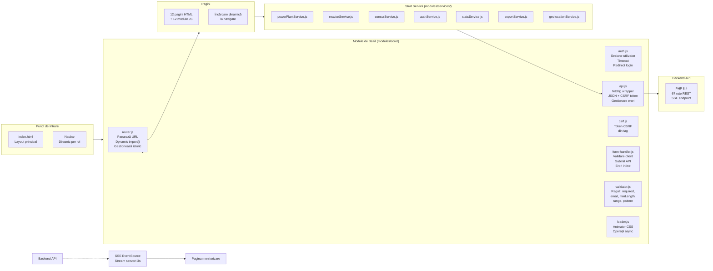

# Diagrama C3 — Frontend: Privire de ansamblu

## Arhitectură SPA (Vanilla JavaScript)



## Fluxul unei navigări

```
  Utilizator dă click pe link
        │
        ▼
  Router.parseURL(window.location)
        │
        ▼
  Dynamic import() → pagină.html + pagină.js
        │
        ▼
  Pagina se inițializează:
  ├── Încarcă template HTML în container
  ├── Inițializează event listeners
  ├── Fetch date inițiale (api.js)
  └── Render UI (tabele, formulare, hărți, chart-uri)
        │
        ▼
  La submit formular:
  ├── Validare client-side (validator.js)
  ├── api.js → fetch() + JSON + CSRF token
  ├── Backend → JSON response
  └── Update DOM cu răspunsul
        │
        ▼
  Pentru SSE (monitorizare):
  ├── new EventSource(url)
  ├── onmessage → parse JSON
  └── Update DOM la fiecare 3s
```

## Module de bază — detalii

| Modul | Fișier | Responsabilitate |
|---|---|---|
| **Router** | `core/router.js` | Parsează URL, dynamic import pagini, istoric browser |
| **Auth** | `core/auth.js` | Verifică sesiunea, timeout, redirect la login |
| **API Client** | `core/api.js` | Wrapper fetch cu JSON, CSRF, erori HTTP |
| **CSRF** | `core/csrf.js` | Citește token-ul CSRF din meta tag |
| **Form Handler** | `core/form-handler.js` | Validare + submit formulare cu feedback vizual |
| **Validator** | `core/validator.js` | Reguli de validare (required, email, range, etc.) |
| **Loader** | `core/loader.js` | Loader animat pentru operații asincrone |

## Licență

Acest document și întregul proiect sunt licențiate sub [Creative Commons Attribution 4.0 International (CC BY 4.0)](https://creativecommons.org/licenses/by/4.0/).
