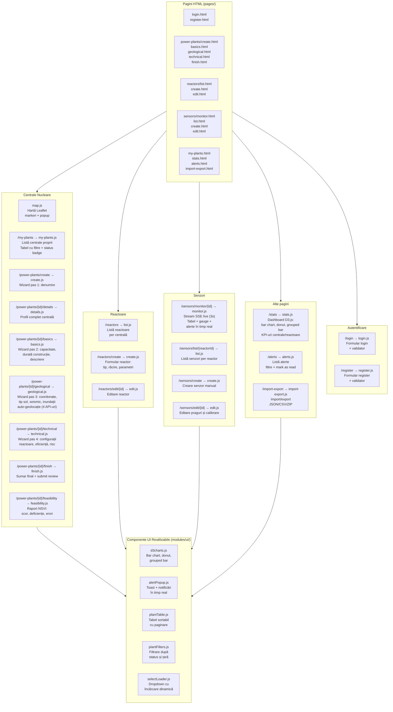

# Diagrama C3 — Frontend: Pagini și Componente

## Arhitectura paginilor

## Harta rutelor complete

| Rută URL | Fișier HTML | Modul JS | Descriere |
|---|---|---|---|
| `/` | `index.html` | `index.js` | Hartă Leaflet cu toate centralele |
| `/login` | `login.html` | `login.js` | Autentificare |
| `/register` | `register.html` | `register.js` | Înregistrare |
| `/my-plants` | `my-plants.html` | `my-plants.js` | Centralele mele |
| `/power-plants/create` | `create.html` | `create.js` | Wizard pas 1 |
| `/power-plants/{id}/details` | `details.html` | `details.js` | Detalii centrală |
| `/power-plants/{id}/basics` | `basics.html` | `basics.js` | Wizard pas 2 |
| `/power-plants/{id}/geological` | `geological.html` | `geological.js` | Wizard pas 3 |
| `/power-plants/{id}/technical` | `technical.html` | `technical.js` | Wizard pas 4 |
| `/power-plants/{id}/finish` | `finish.html` | `finish.js` | Wizard final |
| `/power-plants/{id}/feasibility` | `feasibility.html` | `feasibility.js` | Raport NSVI |
| `/reactors` | `list.html` | `list.js` | Listă reactoare |
| `/reactors/create` | `create.html` | `create.js` | Creare reactor |
| `/reactors/edit/{id}` | `edit.html` | `edit.js` | Editare reactor |
| `/sensors/monitor/{id}` | `monitor.html` | `monitor.js` | Monitorizare SSE |
| `/sensors/list/{id}` | `list.html` | `list.js` | Listă senzori |
| `/sensors/create` | `create.html` | `create.js` | Creare senzor |
| `/sensors/edit/{id}` | `edit.html` | `edit.js` | Editare senzor |
| `/stats` | `stats.html` | `stats.js` | Dashboard statistici |
| `/alerts` | `alerts.html` | `alerts.js` | Listă alerte |
| `/import-export` | `import-export.html` | `import-export.js` | Import/export |

## Licență

Acest document și întregul proiect sunt licențiate sub [Creative Commons Attribution 4.0 International (CC BY 4.0)](https://creativecommons.org/licenses/by/4.0/).
