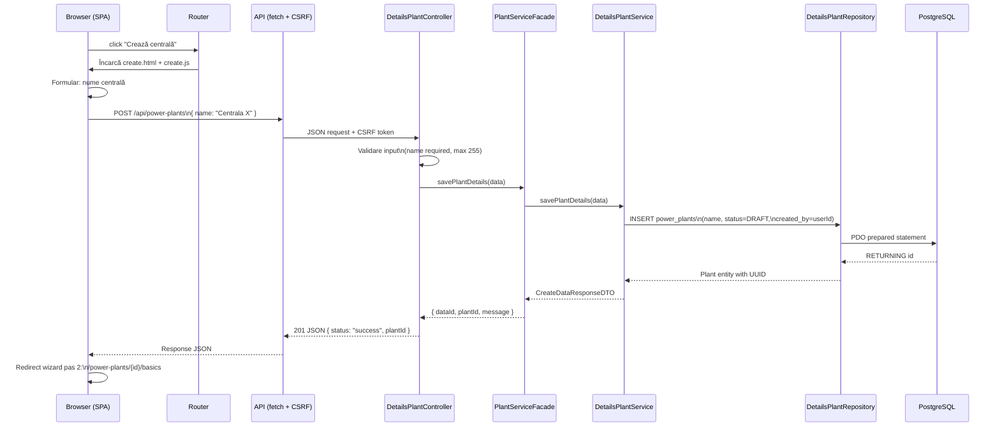
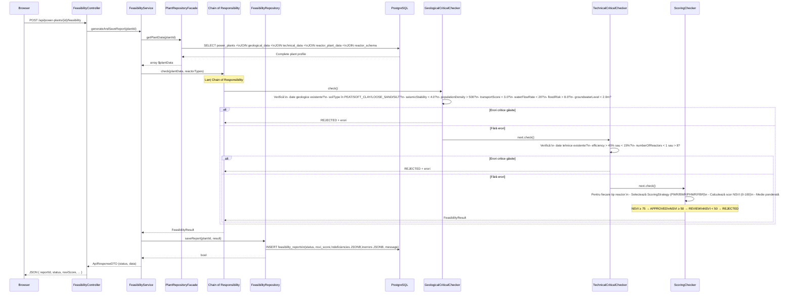
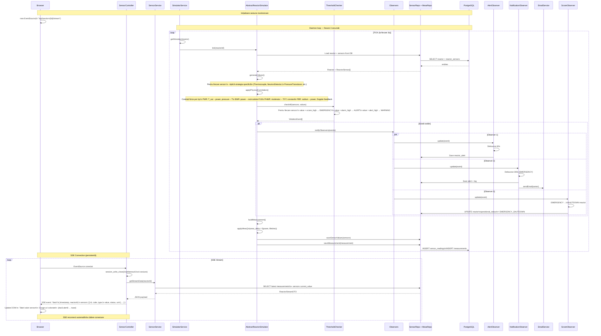
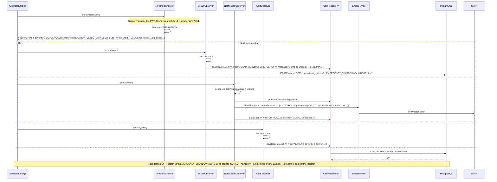
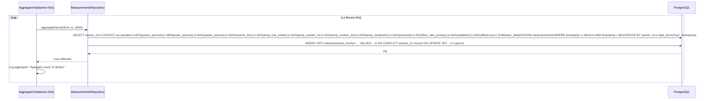

# Diagrama C4 — Cod (Fluxuri de Date)

## 1. Creare centrală — Wizard DRAFT



### Pașii următori (wizard):

```
Pas 2: Basic Data → POST /api/power-plants/{id}/basic
  → BasicPlantController → BasicPlantService → BasicPlantRepository
  → INSERT basic_data (capacity_mw, construction_duration_years, description)

Pas 3: Geological Data → POST /api/power-plants/{id}/geological
  → GeologicalPlantController → GeologicalPlantService
  → Opțional: runAutoGeolocation(lat, lon) → 4 API-uri externe
  → INSERT geological_data (country, lat, lon, soil, seismic, flood, etc.)

Pas 4: Technical Data → POST /api/power-plants/{id}/technical
  → TechnicalPlantController → TechnicalPlantService → TechnicalPlantRepository
  → INSERT technical_data + reactor_plant_data
  → Auto-generare reactoare + senzori din template-uri (tranzacție)
```

## 2. Studiu de fezabilitate — Algoritm NSVI



## 3. Monitorizare SSE — Stream senzori în timp real



## 4. Alertă SCRAM — Oprire de urgență



## 5. Agregare măsurători orare



## Licență

Acest document și întregul proiect sunt licențiate sub [Creative Commons Attribution 4.0 International (CC BY 4.0)](https://creativecommons.org/licenses/by/4.0/).
