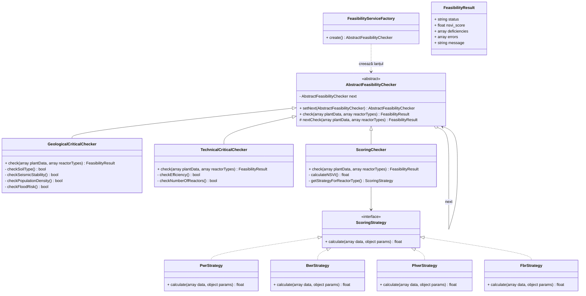

# Diagrama C4 — Pattern: Chain of Responsibility + Strategy

## Lanțul de verificare a fezabilității (NSVI)



## Lanțul de verificare — flux

```
  FeasibilityServiceFactory
        │
        ▼
  GeologicalCriticalChecker → Verifică: sol instabil? seismic < 4? populație > 500?
        │                     transport < 3? debit apă < 20? inundații > 8? freatic < 2m?
        │
        ▼  (dacă OK)
  TechnicalCriticalChecker  → Verifică: eficiență între 15-45%? nr reactoare între 1-8?
        │
        ▼  (dacă OK)
  ScoringChecker → Pentru fiecare tip reactor:
                        ├── PWR → PwrStrategy
                        ├── BWR → BwrStrategy
                        ├── PHWR → PhwrStrategy
                        └── FBR → FbrStrategy
                   Media ponderată = NSVI (0-100)
```

## Criterii de scor NSVI

| Scor NSVI | Status | Acțiune |
|---|---|---|
| ≥ 75 | APPROVED | Centrala poate fi construită |
| ≥ 50 | REVIEW | Necesită revizuire |
| < 50 | REJECTED | Locație nepotrivită |

## Strategii de scor per tip reactor

| Strategie | Penalizări specifice |
|---|---|
| **PwrStrategy** | Eficiență scăzută, proximitate mare apă, debit mic, construcție lungă, risc geologic mare |
| **BwrStrategy** | Seismic sub prag, populație peste prag, transport slab, eficiență scăzută, construcție lungă |
| **PhwrStrategy** | Freatic scăzut (risc tritiu), construcție lungă, eficiență scăzută, seismic scăzut (vulnerabilitate Calandria) |
| **FbrStrategy** | Inundații mari, seismic scăzut, eficiență scăzută, construcție lungă |

## Licență

Acest document și întregul proiect sunt licențiate sub [Creative Commons Attribution 4.0 International (CC BY 4.0)](https://creativecommons.org/licenses/by/4.0/).
