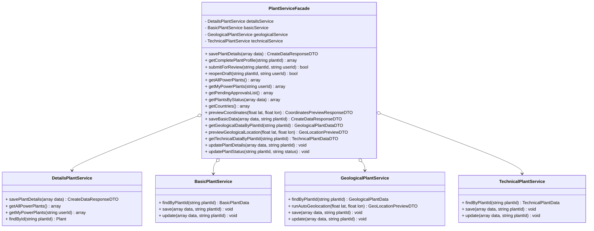
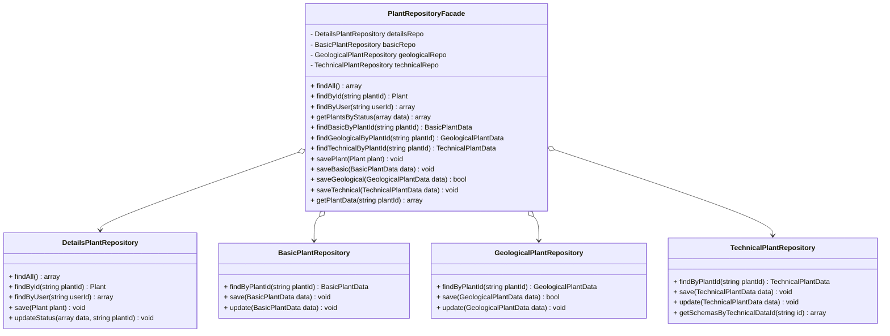
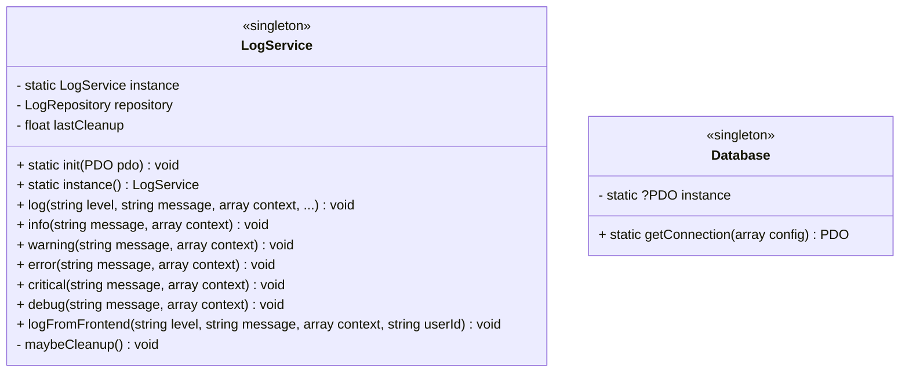

# Diagrama C4 — Pattern: Facade + Singleton

## Fațada serviciilor de centrale



## Fațada repository-urilor



## Singleton — LogService și Database



## Cum funcționează fațadele

```
  Controller
      │
      ▼
  PlantServiceFacade (un singur punct de acces)
      │
      ├──→ DetailsPlantService (nume, status)
      ├──→ BasicPlantService (capacitate, durată)
      ├──→ GeologicalPlantService (coordonate, sol, seismic)
      └──→ TechnicalPlantService (eficiență, configurații reactoare)
              │
              ▼
  PlantRepositoryFacade (un singur punct de acces date)
      │
      ├──→ DetailsPlantRepository (tabela power_plants)
      ├──→ BasicPlantRepository (tabela basic_data)
      ├──→ GeologicalPlantRepository (tabela geological_data)
      └──→ TechnicalPlantRepository (tabela technical_data + reactor_plant_data)
              │
              ▼
  PostgreSQL (18 tabele)
```

## Licență

Acest document și întregul proiect sunt licențiate sub [Creative Commons Attribution 4.0 International (CC BY 4.0)](https://creativecommons.org/licenses/by/4.0/).
