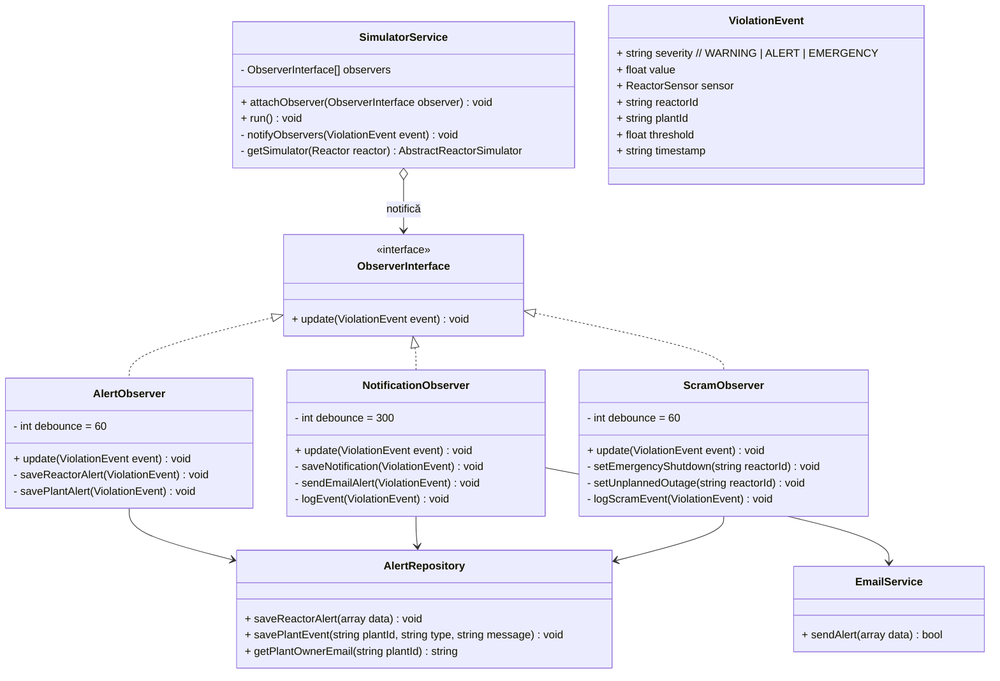

# Diagrama C4 — Pattern: Observer

## Sistemul de alerte și notificări



## Comportamentul observatorilor

| Observer | Debounce | Acțiune la WARNING | Acțiune la ALERT | Acțiune la EMERGENCY |
|---|---|---|---|---|
| **AlertObserver** | 60s | Salvează reactor_alert | Salvează reactor_alert + alert | Salvează reactor_alert + alert |
| **NotificationObserver** | 300s | — | Salvează + loghează | Salvează + loghează + **trimite email** |
| **ScramObserver** | 60s | — | Setează UNPLANNED_OUTAGE | Setează **EMERGENCY_SHUTDOWN** + loghează |

## Fluxul unei alerte EMERGENCY (SCRAM)

```
  Simulator tick()
       │
       ▼
  ThresholdChecker.checkAll()
       │ detectează: neutron_flux > scram_high (8.5e14 > 7.2e14)
       │ severity = EMERGENCY
       ▼
  SimulatorService.notifyObservers(ViolationEvent)
       │
       ├──→ AlertObserver (debounce 60s)
       │       └── INSERT reactor_alert (type=SCRAM, severity=EMERGENCY)
       │
       ├──→ ScramObserver (debounce 60s)
       │       └── UPDATE reactor SET operational_status = 'EMERGENCY_SHUTDOWN'
       │
       └──→ NotificationObserver (debounce 300s, prima dată instant)
               ├── INSERT alert + log entry
               └── EmailService.sendAlert()
                       └── PHPMailer → SMTP (Mailtrap)
```

## Licență

Acest document și întregul proiect sunt licențiate sub [Creative Commons Attribution 4.0 International (CC BY 4.0)](https://creativecommons.org/licenses/by/4.0/).
