# Diagrama C4 — Pattern: Strategy (Generare Valori)

## Cele 12 strategii de generare a valorilor senzorilor

```mermaid
classDiagram
  class SensorGeneratorStrategy {
    <<interface>>
    + generate(float current, object limits, object params) float
  }

  class ThermocoupleStrategy {
    + generate(float current, object limits, object params) float
  }

  class NeutronDetectorStrategy {
    + generate(float current, object limits, object params) float
  }

  class PressureTransducerStrategy {
    + generate(float current, object limits, object params) float
  }

  class FlowMeterStrategy {
    + generate(float current, object limits, object params) float
  }

  class RadiationMonitorStrategy {
    + generate(float current, object limits, object params) float
  }

  class VibrationSensorStrategy {
    + generate(float current, object limits, object params) float
  }

  class LevelSensorStrategy {
    + generate(float current, object limits, object params) float
  }

  class ActivityMonitorStrategy {
    + generate(float current, object limits, object params) float
  }

  class SeismicSensorStrategy {
    + generate(float current, object limits, object params) float
  }

  class HydrogenDetectorStrategy {
    + generate(float current, object limits, object params) float
  }

  class ValvePositionStrategy {
    + generate(float current, object limits, object params) float
  }

  class PumpSpeedStrategy {
    + generate(float current, object limits, object params) float
  }

  SensorGeneratorStrategy <|.. ThermocoupleStrategy
  SensorGeneratorStrategy <|.. NeutronDetectorStrategy
  SensorGeneratorStrategy <|.. PressureTransducerStrategy
  SensorGeneratorStrategy <|.. FlowMeterStrategy
  SensorGeneratorStrategy <|.. RadiationMonitorStrategy
  SensorGeneratorStrategy <|.. VibrationSensorStrategy
  SensorGeneratorStrategy <|.. LevelSensorStrategy
  SensorGeneratorStrategy <|.. ActivityMonitorStrategy
  SensorGeneratorStrategy <|.. SeismicSensorStrategy
  SensorGeneratorStrategy <|.. HydrogenDetectorStrategy
  SensorGeneratorStrategy <|.. ValvePositionStrategy
  SensorGeneratorStrategy <|.. PumpSpeedStrategy

  class AbstractReactorSimulator {
    + generateValues() void
    - getStrategy(SensorType) SensorGeneratorStrategy
  }

  AbstractReactorSimulator --> SensorGeneratorStrategy : folosește
```



## Comportamentul fiecărei strategii

| Strategie | Comportament |
|---|---|
| **ThermocoupleStrategy** | Pas Gaussian mic (0.3% din range). Forță de tracțiune spre centru. Minim -273.15°C |
| **NeutronDetectorStrategy** | Zgomot statistic + drift + spike-uri ocazionale de 8% (2% probabilitate). Minim 0 |
| **PressureTransducerStrategy** | Pas Gaussian + drop-uri ocazionale 2% (0.5% prob). Minim 0 |
| **FlowMeterStrategy** | Pas Gaussian + drop-uri 15% (0.2% prob de pompare). Minim 0 |
| **RadiationMonitorStrategy** | Pas Gaussian + spike-uri 12% (0.8% prob). Decay la bază (5% deasupra minimului). Minim 0 |
| **VibrationSensorStrategy** | Zgomot de fond + evenimente mecanice 25% (1% prob). Amortizare la bază (10%). Minim 0 |
| **LevelSensorStrategy** | Pas Gaussian mic + scurgeri 0.5% (0.3% prob). Forță puternică de control la setpoint. Minim 0 |
| **ActivityMonitorStrategy** | Pas Gaussian + spike-uri 20% (0.4% prob). Decay la bază (8%). Minim 0 |
| **SeismicSensorStrategy** | Zgomot foarte mic + evenimente seismice rare 40% (0.05% prob) + afterșocuri. Minim 0 |
| **HydrogenDetectorStrategy** | Zgomot mic + acumulări 1.5% (0.6% prob). Recombinare decay (5%). Minim 0 |
| **ValvePositionStrategy** | 5% șansă mișcare per tick. 1-3 pași direcție. Tracțiune spre setpoint dacă departe (>10). Minim 0 |
| **PumpSpeedStrategy** | Pas Gaussian + trip-uri 20% (0.2% prob). Boost sub 30% nominal. Tracțiune la nominal. Minim 0 |

## Senzorii generați per reactor

Fiecare reactor primește 12 senzori la creare, generați din `sensor_templates`:

```
  THERMOCOUPLE        → Măsoară temperatura (°C)
  PRESSURE_TRANSDUCER → Măsoară presiunea (bar)
  NEUTRON_DETECTOR    → Măsoară fluxul de neutroni (n/cm²·s)
  FLOW_METER          → Măsoară debitul (kg/s)
  RADIATION_MONITOR   → Măsoară radiația (μSv/h)
  VIBRATION_SENSOR    → Măsoară vibrațiile (mm/s)
  LEVEL_SENSOR        → Măsoară nivelul (m)
  ACTIVITY_MONITOR    → Măsoară activitatea (Bq/m³)
  SEISMIC_SENSOR      → Măsoară activitatea seismică (MG)
  HYDROGEN_DETECTOR   → Măsoară concentrația H₂ (ppm)
  VALVE_POSITION      → Măsoară poziția valvei (%)
  PUMP_SPEED          → Măsoară turația pompei (rpm)
```

## Licență

Acest document și întregul proiect sunt licențiate sub [Creative Commons Attribution 4.0 International (CC BY 4.0)](https://creativecommons.org/licenses/by/4.0/).
