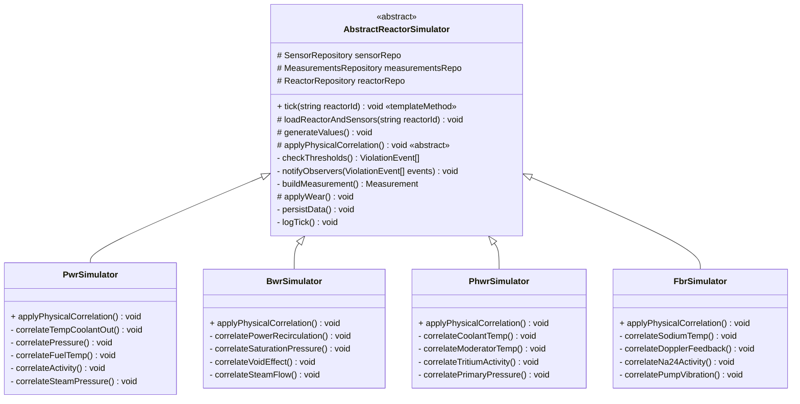

# Diagrama C4 — Pattern: Template Method

## Simularea reactorilor



## Metoda `tick()` — șablon fix

```
  tick(reactorId)
  ═══════════════
       │
       1. loadReactorAndSensors(reactorId)
       │    ├── SELECT reactor FROM reactors WHERE id = ?
       │    └── SELECT * FROM reactor_sensors WHERE reactor_id = ?
       │
       2. generateValues()
       │    ├── Pentru fiecare senzor → strategie specifică
       │    │   (Thermocouple, NeutronDetector, PressureTransducer, etc.)
       │    └── Valorile sunt stocate pe entitatea senzorului
       │
       3. applyPhysicalCorrelation()  ← ABSTRACT, implementat per tip
       │    ├── PWR:   T_out ~ power; pressure ~ T; fuelT ~ power
       │    ├── BWR:   power ~ recirculation^0.8; void ~ power
       │    ├── PHWR:  coolantT ~ power; moderator ~ 70°C constant
       │    └── FBR:   sodiumT ~ power; Doppler feedback < 0
       │
       4. checkThresholds()
       │    ├── Pentru fiecare senzor:
       │    │   value > scram_high   → EMERGENCY
       │    │   value > alarm_high   → ALERT
       │    │   value > alert_high   → WARNING
       │    └── Returnează ViolationEvent[]
       │
       5. notifyObservers(events)
       │    ├── AlertObserver
       │    ├── NotificationObserver
       │    └── ScramObserver
       │
       6. buildMeasurement()
       │    └── Construiește Measurement cu 26 de câmpuri
       │
       7. applyWear()
       │    └── wear_delta = f(power_percent, wear_index, design_lifetime)
       │
       8. persistData()
       │    ├── UPDATE reactor_sensors SET current_value, last_reading_at
       │    └── INSERT INTO measurements (...)
       │
       9. logTick()
       │    └── LogService::info("Tick reactor X completat")
```

## Corelații fizice per tip reactor

| Tip | Corelații |
|---|---|
| **PWR** | T coolant_out urmează puterea; T coolant_in = T_out - ~30°C; presiunea primară corelată cu T; debit corectat cu densitatea; T combustibil urmează puterea; activitate primară crescută când coolant > 310°C; presiune abur urmează T primară |
| **BWR** | Puterea urmează debit recirculare ^0.8; T ieșire miez urmează puterea; presiunea de saturație urmează T; T combustibil urmează puterea; debit abur urmează puterea; nivel apă vas scade la putere mare (efect void); activitate crescută la T mare |
| **PHWR** | T coolant urmează puterea; T moderator ~70°C constantă; presiunea primară corelată cu T; activitate tritiu în moderator crește cu puterea; debit coolant urmează √(presiune) |
| **FBR** | T ieșire sodium urmează puterea; T intrare = T ieșire - ~150°C; presiunea sodium primar ~constantă; activare Na-24 ∝ putere + decay; feedback Doppler ( coeficient T negativ → reduce puterea la T combustibil > 800°C); vibrații pompă ∝ debit² |

## Licență

Acest document și întregul proiect sunt licențiate sub [Creative Commons Attribution 4.0 International (CC BY 4.0)](https://creativecommons.org/licenses/by/4.0/).
